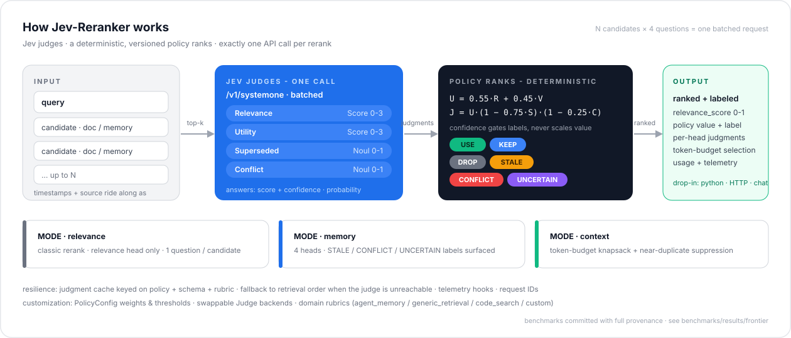
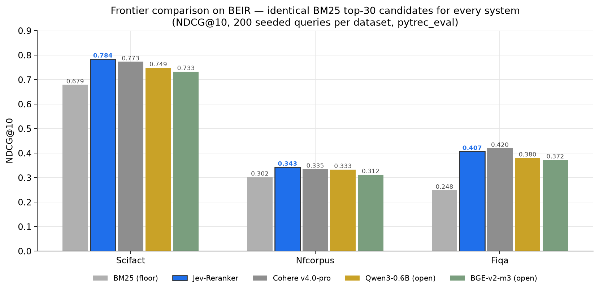
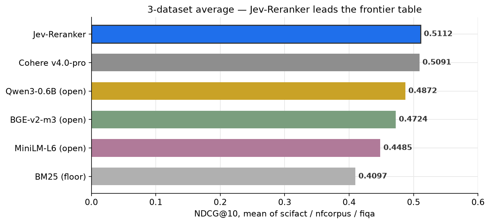
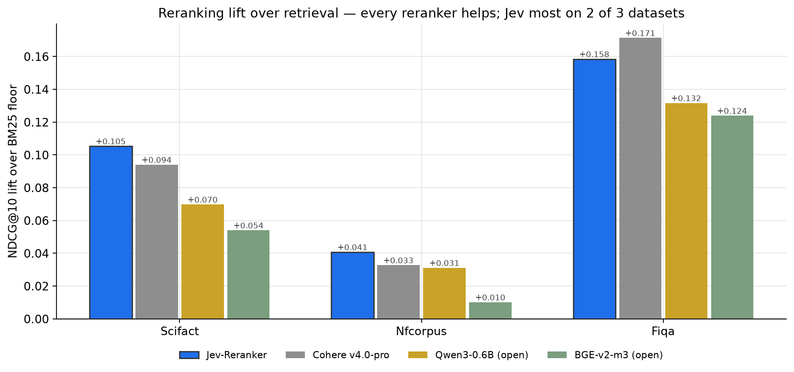
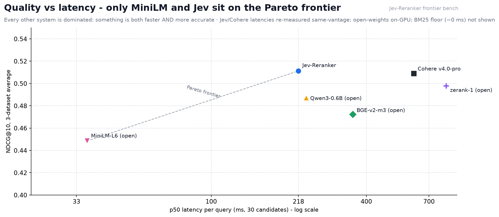
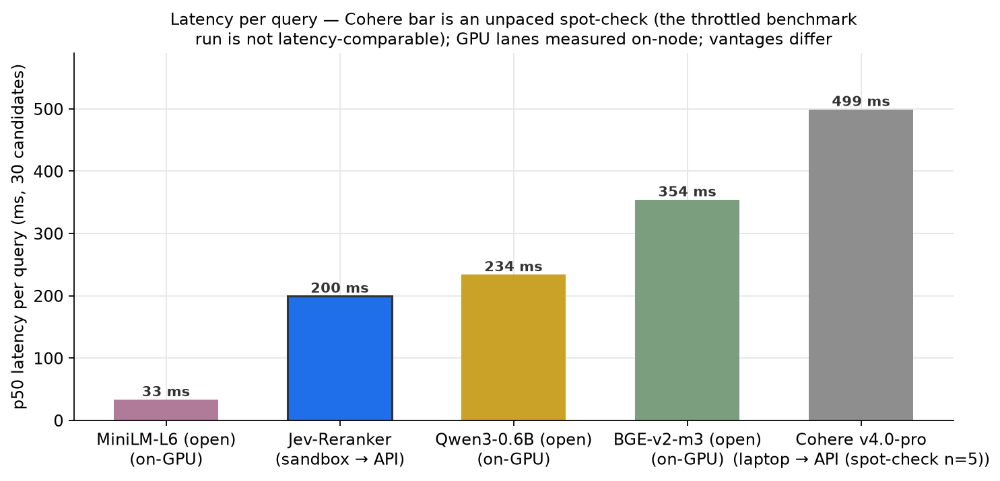
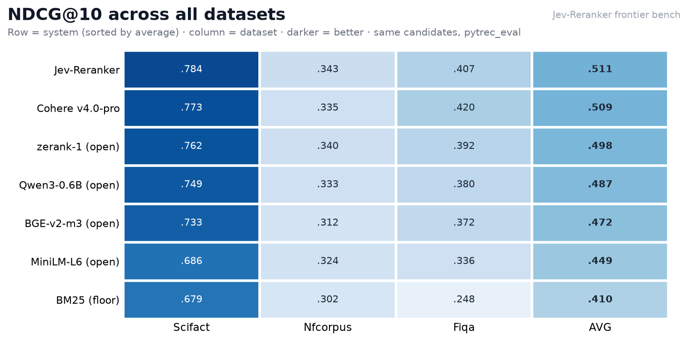

# Jev-Reranker

<p align="center">
  
</p>

<p align="center">
  <a href="benchmarks/results/frontier/README.md"></a>
  
  
  
  
  
</p>

**Decision-aware, calibrated context selection for AI agents, powered by TypeSafe Jev.**
Jev judges; deterministic Python policy ranks. **One Jev call per rerank** — never one call per memory.

**Contents:** [Three modes](#three-modes) · [Design](#design-one-batched-jev-call) · [Setup](#setup) · [Usage](#usage) · [Generic use](#generic-use-any-retrieval-project) · [BEIR mini-study](#frontier-comparison-jev-vs-hosted--open-weights-rerankers-on-beir-2026-09-23) · [Other checks](#other-checks) · [Layout](#layout)

Instead of embedding similarity, Jev-Reranker asks a System-1 decision model
(Jev `/v1/systemone`) up to four calibrated questions per candidate — relevance
(Score 0–3), utility (Score 0–3), superseded (Noul 0–1), conflict (Noul 0–1) —
**all batched into a single request**, then applies a transparent,
versioned policy (`POLICY_VERSION=v2`, `QUESTION_SCHEMA_VERSION=v2`) to rank,
label, and select.

## Three modes

| Mode | What it does |
|---|---|
| `relevance` | Classic query/passage rerank on policy value (relevance head only). |
| `memory` | Agent-memory triage: `STALE` / `CONFLICT` / `UNCERTAIN` labels surfaced, superseded + conflict heads fully active. |
| `context` | Token-budget selection: near-duplicate suppression, then greedy value-per-token knapsack over non-`DROP` items so the host agent always fits its window. |

Labels: `USE` (feed the agent) · `KEEP` (background, budget permitting) ·
`DROP` (below value threshold) · `STALE` (superseded) · `CONFLICT`
(contradicted elsewhere) · `UNCERTAIN` (judge confidence below gate).

## Design: one batched Jev call

`policy.build_questions` builds the 4N question map (`rel__<id>`,
`util__<id>`, `sup__<id>`, `con__<id>`); `LiveJevJudge` translates it to SDK
`Score`/`Noul` questions and issues **exactly one** `TypeSafeClient.system_one()`
call per `rerank`/`select` (asserted in tests: `judge.calls == 1`).
Per-case `judge_calls_per_rerank = 1.0` is measured in the synthetic eval.

Two hard rules, enforced by the policy and covered by tests:

1. **Confidence never scales the value.** `policy_value` uses only the two
   Score heads (normalized 0–3 → 0–1) minus superseded/conflict penalties.
   Confidence only *gates*: below `confidence_gate` (0.45) an item becomes
   `UNCERTAIN` instead of acting on its value.
2. **Never one Jev call per memory.** Candidates × heads are one payload;
   resilience (candidate caps, truncation, cache, fallback) keeps the host
   agent non-brittle when Jev is unreachable (`fallback='retrieval_order'`
   preserves retrieval order with zero-confidence `UNCERTAIN` judgments).

## Setup

```bash
pip install -e ".[dev]"          # tests, lint, types (+numpy for eval extras)
pip install -e ".[integrations]" # langchain / llama-index / qdrant adapters
pip install -e ".[server]"       # fastapi + uvicorn for the HTTP surface
export TYPESAFE_API_KEY=...      # live Jev; without it, OfflineJudge is used
```

`JevReranker()` auto-picks `LiveJevJudge` iff `TYPESAFE_API_KEY` is set,
else the deterministic lexical `OfflineJudge` (test/eval/demo only —
always labeled `offline-judge-v2`, never presented as Jev output).

## Usage

```python
from jev_reranker import Candidate, JevReranker

rr = JevReranker()
res = rr.rerank(
    "how long do refunds take to settle?",
    [Candidate(id="a", text="Refunds settle within 5 business days.", retrieval_rank=0),
     Candidate(id="b", text="OUTDATED deprecated old version: refunds settle in 30 days.",
               retrieval_rank=1)],
    mode="memory",
)
for it in res.items:
    print(it.rank, it.label.value, round(it.value, 3), it.candidate.text)

sel = rr.select("summarize the refund policy", cands, budget_tokens=150)
print(sel.total_tokens, "of", sel.budget_tokens)
```

More: `examples/quickstart.py`, `examples/memory_triage.py`,
`examples/context_budget.py`, `examples/generic_retrieval.py`,
`demo/arena.py --cli` (or `streamlit run demo/arena.py`). Framework adapters
(LangChain compressor, LangGraph `memory_triage_node`, LlamaIndex
postprocessor, Qdrant helper) live in `jev_reranker.integrations`.

## Frontier comparison: Jev vs hosted + open-weights rerankers on BEIR (2026-09-23)

Identical BM25 top-30 candidate lists re-scored by every system, NDCG@10,
200 seeded queries per dataset (`benchmarks/results/frontier/`):

| dataset | BM25 floor | **Jev-Reranker** | Cohere v4.0-pro | zerank-1 (open) | Qwen3-0.6B (open) | BGE-v2-m3 (open) | MiniLM-L6 (open) |
|---|---|---|---|---|---|---|---|
| scifact | 0.679 | **0.784** | 0.773 | 0.763 | 0.749 | 0.733 | 0.686 |
| nfcorpus | 0.302 | **0.343** | 0.335 | 0.340 | 0.333 | 0.312 | 0.324 |
| fiqa | 0.249 | 0.407 | **0.420** | 0.392 | 0.380 | 0.372 | 0.336 |
| average | 0.410 | **0.511** | 0.509 | 0.498 | 0.487 | 0.472 | 0.449 |

Latency per query (p50, 30 candidates): MiniLM-L6 33 ms (on-GPU) ·
**Jev 218 ms** (API, same-vantage pair) · Qwen3-0.6B 234 ms (on-GPU) ·
BGE-v2-m3 354 ms (on-GPU) · Cohere ~611 ms (API, same-vantage pair).

**By dataset.** Jev tops SciFact and NFCorpus; Cohere's flagship edges
FiQA. The two API leaders never separate by more than 0.012 on any
dataset.



**3-dataset average.** A statistical tie at the top (0.511 vs 0.509 at
n=200 per dataset); the open-weights field packs into 0.449–0.498; every
reranker clears the BM25 floor by +0.04 to +0.10.



**Lift over retrieval.** Reranking pays most where retrieval is weakest —
+0.10 to +0.17 on FiQA vs +0.01 to +0.04 on NFCorpus. Jev posts the
largest lift on 2 of 3 datasets.



**Quality vs latency — the production-deciding pair.** Only MiniLM and
Jev sit on the Pareto frontier; every other system (Cohere, zerank-1,
Qwen3, BGE) is dominated — something faster is also more accurate.



**Latency.** Same-box fair pair: Jev 218 ms vs Cohere 611 ms (zero cache
hits, rotating live queries). Jev also serves repeat queries from cache
at ~1.3 ms.



**Full matrix.** The quality ordering is stable across all three datasets:
Jev never leaves the top 2, BM25 never leaves last.



A general-purpose decision model, zero-shot through explicit questions,
matches Cohere's purpose-trained flagship (wins 2 of 3 datasets and the
average) and leads every open-weights reranker — including ZeroEntropy's
4B zerank-1 — on 2 of 3 datasets, at competitive latency. Voyage (trial
quota exhausted) is documented as attempted-not-reported — full caveats,
protocol, and reproduction steps in
`benchmarks/results/frontier/README.md`.


## Generic use: any retrieval project

The policy math is domain-agnostic; the *questions* encode what your domain
means by relevant/usable/superseded/conflicting, so they are configurable:

```python
from jev_reranker import JevReranker, Rubric, ScoreHeadRubric, NoulHeadRubric

rr = JevReranker(rubric="code_search")            # built-in preset
# ...or fully custom:
legal = Rubric(
    name="legal",
    rel=ScoreHeadRubric(instructions="Is candidate [cid] controlling authority for the query?",
                        criteria=["off point", "background", "persuasive", "controlling"]),
    util=ScoreHeadRubric(instructions="How actionable is candidate [cid]?",
                         criteria=["no holdings", "background only", "on-point dicta", "directly on point"]),
    sup=NoulHeadRubric(instructions="Was candidate [cid] overruled?",
                       criteria={"true": "Newer authority controls", "false": "Still good law"}),
    con=NoulHeadRubric(instructions="Does candidate [cid] conflict?",
                       criteria={"true": "Contradicted elsewhere", "false": "Consistent"}),
)
rr = JevReranker(rubric=legal)
```

Built-ins: `agent_memory` (default — the original benchmark questions,
byte-identical), `generic_retrieval` (documents/RAG), `code_search`. Rubric
identity is part of the judgment cache key — swapping rubrics never serves
stale judgments.

**Ecosystem-standard outputs.** Every ranked item carries
`relevance_score ∈ [0,1]` (raw relevance head / 3 — comparable within one
call, not ratio-scale), independent of the policy `value`. For hosted-API
compatibility, `CohereCompatReranker` speaks the exact request/response shape
the rerank market standardized on (`results: [{index, relevance_score,
document}]`, positional `index`, Jev extras under `meta.jev`):

```python
from jev_reranker import CohereCompatReranker
body = CohereCompatReranker(reranker=rr).rerank("query", ["doc one", "doc two"], top_n=2)
```

The same contract over HTTP — any language, any HTTP client:

```bash
pip install "jev-reranker[server]"
uvicorn jev_reranker.server:app --port 8494
# POST /rerank  {query, documents, top_n}     (Cohere shape)
# POST /select  {query, documents, budget_tokens}
# GET  /health  (reports which judge is serving — offline responses are
#                never presented as Jev output)
```

**Ergonomics.** Sync `rerank`/`select` are safe to call from inside a running
event loop (Jupyter, FastAPI handlers) — they no longer use `asyncio.run` on
the hot path — and accept plain strings anywhere Candidates are expected
(`rr.rerank("query", ["doc one", "doc two"])`). The `heads` argument narrows
a call's question set (e.g. `rerank(..., mode="memory", heads=("rel",
"sup"))`) — still one batched Jev call per rerank. `acompress_documents`
mirrors the LangChain compressor async-first.

Open for generic adoption (honest list): latency/cost at the 100-candidate
cap is unmeasured live (measured numbers are at benchmark scale, 4-6
candidates); documents are single-text (no title/multi-field or
per-doc chunking yet); question rubrics are configurable but the *head set*
(rel/util/sup/con) is fixed — new head types need code, not config.

## Measured results — MemoryBench-JR, live Jev

500 deterministic cases across 10 hard-memory categories (superseded fact,
contradiction, near-duplicate, wrong-entity decoy, old-plan-vs-final,
changed preference, temporal query, lexical decoy, multi-hop,
answer-not-present). Run against **live `jev-latest`**: 1,000 API calls
(two batched reranks per case), **0 fallbacks**, p50 184.8 ms.
Full provenance committed in `benchmarks/results/memorybench_jr_live.json`
(2026-09-20, host `vps-e2191ccf`, seed 7, commit `f0ceaaf`).

Reproduce:

```bash
pip install -e ".[dev]"
export TYPESAFE_API_KEY=...
python -m benchmarks.memorybench_jr.run_eval --judge live --n 500 --seed 7
```

| metric | value |
|---|---|
| relevance mode recall@1 / recall@3 | 0.889 / 1.000 |
| memory mode recall@1 / recall@3 | 0.829 / 1.000 |
| rejection accuracy (answer-not-present, both modes) | 1.000 |
| STALE label precision / recall / F1 | 0.850 / 0.990 / 0.915 |
| CONFLICT label precision / recall / F1 | 0.385 / 1.000 / 0.556 |
| context precision / recall / efficiency (45% budget) | 0.619 / 0.850 / 0.782 |
| near-duplicate dedup precision / recall / F1 | 0.232 / 0.460 / 0.309 |

Versus baselines on the same cases (relevance recall@1 / recall@3):
retrieval order 0.111 / 0.747; hashed bag-of-words embedding 0.553 / 0.944;
Jev relevance mode 0.889 / 1.000; Jev memory mode 0.829 / 1.000.

Calibration (n=2,000 judgments per head, from the live predictions): Brier /
ECE — useful 0.093 / 0.122, relevant 0.135 / 0.176, superseded 0.037 / 0.094,
conflict 0.099 / 0.195. The live judge is uniformly overconfident (reliability
curves in `benchmarks/results/`); policy thresholds were deliberately **not**
tuned to these numbers.

Known weak spots, stated plainly:

- **CONFLICT precision 0.385** (80 false positives vs 50 true positives) —
  the conflict head fires too readily. Retuning `conflict_threshold` from the
  committed calibration threshold table is open work.
- **Dedup F1 0.309** — near-duplicate suppression uses hashed bag-of-words
  embeddings (dependency-free by design); recall 0.46 means half of true
  near-duplicates survive. A real embedding model is the likely upgrade.
- MemoryBench-JR is self-generated (deterministic generator) — it measures the
  pipeline against constructed hard cases, not organic data. The LongMemEval
  slice runner exists (`longmemeval_slice.py`) but no numbers are reported:
  the dataset was unreachable from the build VM.

## Offline synthetic eval (pipeline mechanics)

`python -m jev_reranker.eval_synthetic --n 300 --seed 7` — 300 generated cases
(6 categories × 50: stale, conflict, distractor, paraphrase, multi_hop,
recency), real `JevReranker` pipeline on the deterministic lexical
`offline-judge-v2` (trace: `benchmarks/results/synthetic_eval.json`;
identical rerun inside a Blaxel sandbox:
`synthetic_eval_blaxel.json`): recall@1 0.1667, recall@3 0.8333, STALE/CONFLICT
label F1 1.0, judge calls per rerank 1.0, fallback rate 0.0, p50 ~1.3 ms.

Caveat (read before quoting): these recall numbers are bounded by the
*lexical* offline judge — distractors repeat the query verbatim, so token
overlap favors them over the gold answer. What this eval genuinely verifies
is pipeline mechanics: exactly one judge call per rerank, perfect
STALE/CONFLICT flagging on cue-bearing memories, zero fallbacks. Ranking
quality against live Jev is measured in the live section above; on the same
300 cases the offline judge lands all confidence in `[0.75, 1.00]` at
accuracy 0.167 — uniformly overconfident, so its confidence carries no
discrimination, which is why thresholds were never tuned to it.

## Other checks

`pytest` 64 passed; `ruff check` clean; `mypy --strict` clean (18 source
files) — current tree, Python 3.12 (2026-09-22). Arena CLI verified on both
samples (STALE + CONFLICT correctly flagged) and all three examples run
(VM, 2026-09-19).

## Layout

```
src/jev_reranker/  policy.py rubric.py client.py judges.py models.py reranker.py
                   cache.py dedup.py eval_synthetic.py longmemeval_slice.py server.py
                   integrations/ (langchain, langgraph, llamaindex, qdrant, cohere_compat)
tests/             policy / client / reranker / rubric / dedup / cache-schema / memorybench / server (64 tests)
examples/ demo/ benchmarks/memorybench_jr/ benchmarks/results/ scripts/run_benchmarks.py
```

---

License: MIT · Built on [TypeSafe](https://docs.typesafe.ai)'s Jev decision model — an independent project, not affiliated with TypeSafe, Cohere, Voyage AI, ZeroEntropy, Qwen or BAAI. Benchmark numbers come from our own mini-study; the [run card](benchmarks/results/frontier/README.md) has the full protocol and caveats.
