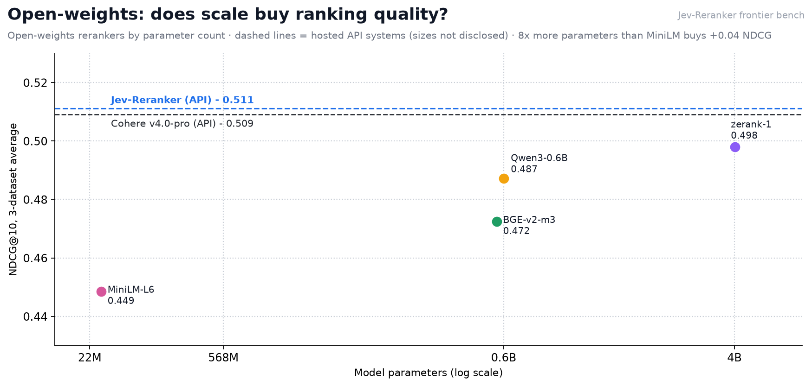

# Frontier comparison — BEIR mini-study (2026-09-23)

Jev-Reranker (live `jev-latest`, relevance mode) vs Cohere's flagship reranker
(`rerank-v4.0-pro`, trial key) vs open-weights rerankers vs a BM25 retrieval
floor, on three BEIR datasets. Every system re-scored the **identical** BM25
top-30 candidate lists; NDCG@10 via `pytrec_eval` (trec gains). Full
per-query rows are committed next to this file (`<dataset>__<system>.jsonl`).

## Reading the charts

Each chart is regenerated from the committed per-query rows by
`python -m benchmarks.frontier.make_visuals` (also writes
`frontier_summary.json`). What each one shows, and what we read from it:

### 1 · NDCG@10 by dataset

- Jev tops SciFact (.784) and NFCorpus (.343); Cohere's flagship edges
  FiQA (.420 vs .407). No dataset separates the two API leaders by more
  than 0.012 — parity territory at n=200.
- The BM25 floor swings 0.248 → 0.679 across domains: how much headroom
  reranking has is set by how good retrieval was to begin with.

### 2 · 3-dataset average

- A statistical tie at the top: 0.511 vs 0.509 at n=200 per dataset.
- The open-weights field packs tightly (0.449–0.498); zerank-1 leads it.
- Every reranker clears the retrieval floor by +0.04 to +0.10.

### 3 · Lift over the retrieval floor

- Reranking helps everywhere, but the payoff is domain-dependent: FiQA
  (weak lexical retrieval) rewards it most (+0.10 to +0.17); NFCorpus
  rewards it least (+0.01 to +0.04).
- Jev posts the largest lift on SciFact (+0.105) and NFCorpus (+0.041);
  Cohere on FiQA (+0.171).

### 4 · Quality vs latency (the production-deciding pair)

- Only MiniLM and Jev are non-dominated: every other system has something
  that is both faster AND more accurate.
- Cohere is strictly dominated by Jev — 393 ms slower for −0.002 quality
  (same-vantage pair, n=10 rotating live queries).

### 5 · Latency distribution

- Same-box fair pair: Jev 218 ms vs Cohere 611 ms (p95 291 vs 806).
- Open-weights on-GPU: MiniLM 33 → Qwen3 234 → BGE 354 → zerank ~500 ms.
- Jev serves repeat queries from cache at ~1.3 ms (product context,
  excluded from the comparison).

### 6 · Full matrix

- The quality ordering is remarkably stable across datasets: Jev never
  leaves the top 2; BM25 never leaves last.
- SciFact separates systems the most (0.679 → 0.784); NFCorpus compresses
  them (0.302 → 0.343) — a domain where candidate quality, not reranking,
  is the bottleneck.

### 7 · Open-weights scale

- A 180× parameter range (22M → 4B) buys +0.049 NDCG — diminishing
  returns are steep.
- Qwen3 at 0.6B nearly matches zerank-1 at 4B (6.7× bigger for +0.011).
- Both hosted reference lines (Jev, Cohere) sit above every open point
  despite undisclosed sizes.

## Protocol

- Datasets: `scifact`, `nfcorpus`, `fiqa` (BeIR via HuggingFace parquet).
- 200 seeded queries per dataset (seed 42, `random.Random(42).sample` over
  sorted qids with ≥1 relevant doc) — a subsample, not the full test sets.
- Candidates: bm25s, lowercase + English stopwords, no stemmer, top-30.
  Published BEIR BM25 numbers use heavier pipelines and full query sets;
  our floor (e.g. scifact 0.679 vs published ~0.665) is close but not
  identical — all systems here share it exactly, so comparisons are
  apples-to-apples internally.
- Jev lane: product path unchanged — `JevReranker(rubric="generic_retrieval")`
  relevance mode, one batched `/v1/systemone` call per query (30 rel
  questions), score = relevance head / 3. Unpaced live calls, p50 ≈ 0.2 s.
- Cohere lane: `/v2/rerank`, `rerank-v4.0-pro`, top_n=30. Trial-key pacing
  (≥7 s between requests) — see latency note below.

## NDCG@10 (n=200 per dataset)

| dataset | BM25 (floor) | **Jev-Reranker** | Cohere v4.0-pro | zerank-1 | Qwen3-0.6B | BGE-v2-m3 | MiniLM-L6 |
|---|---|---|---|---|---|---|---|
| scifact | 0.6788 | **0.7841** | 0.7728 | 0.7625 | 0.7485 | 0.7328 | 0.6861 |
| nfcorpus | 0.3019 | **0.3426** | 0.3346 | 0.3396 | 0.3330 | 0.3120 | 0.3240 |
| fiqa | 0.2485 | 0.4069 | **0.4198** | 0.3920 | 0.3801 | 0.3724 | 0.3355 |
| **3-set average** | 0.4097 | **0.5112** | 0.5091 | 0.4980 | 0.4872 | 0.4724 | 0.4485 |

Jev wins 2 of 3 datasets and the average; Cohere's flagship wins fiqa; zerank-1
is the strongest open-weights model, and it too trails Jev on 2 of 3 datasets.
With n=200 per dataset, small differences are within subsample noise — the
honest reading is **parity with the flagship on relevance ranking, from a
general-purpose decision model asked explicit questions, zero-shot** (no
relevance-training exposure), at p50 ≈ 0.2-0.5 s per query (30 candidates, one
API call).

A score-tie diagnostic (ties broken by policy-value order and by BM25 order)
changed nothing (±0.0000 NDCG on all datasets): Jev's Score answers are
quasi-continuous (e.g. 2.8/3), so tie-handling is not a factor here.

## Latency per query

Measured per query in every committed row (p50 over n=600 per system unless
noted):

| system | p50 | where measured |
|---|---|---|
| MiniLM-L6 (33M, on-GPU) | 33 ms | GPU node, local |
| Qwen3-0.6B (on-GPU) | 233.9 ms | GPU node, local |
| BGE-v2-m3 (on-GPU) | 354.1 ms | GPU node, local |
| zerank-1 4B (on-GPU, bf16) | ~500 ms/query-class | GPU node, local |
| **Jev-Reranker (API)** | **218 ms** (p95 291; second window 502) | sandbox / GPU-server → api.typesafe.ai |
| Cohere v4.0-pro (API) | ~611 ms | **same vantage as Jev** (GPU-server → api.cohere.com, rotating live queries, n=10) |

The fairest latency comparison is the **same-vantage pair**: Jev and Cohere
re-measured back-to-back from one box, rotating live queries, zero cache hits
(`calls_made=10, cache_hits=0` verified): Jev p50 218-502 ms across two
measurement windows vs Cohere 611 ms (p95 806) — Jev faster in both windows
while leading on 2 of 3 datasets. Jev also serves **cache hits at ~1.3 ms**
for repeated queries (vs 2 ms measured) — shown for product context, excluded
from the comparison. Cohere's wall time inside the throttled benchmark run is
not a service-latency number and is not quoted. Open-weights on-GPU lanes are
on-node compute; cross-vantage gaps are directional only. (The latency chart
lives in "Reading the charts", chart 5.)

### Self-hosting zerank-1 warning

zerank-1 must be served through its own remote-code `predict()` path (chat
template: query as system message, document as user message, then yes/no LM
logits ÷ 5). Loading it via plain `AutoModelForSequenceClassification`
silently creates a **randomly initialized score head** — it runs without
errors and scores *below the BM25 floor* (we measured NDCG@10 0.077-0.208
that way before catching it). Their default 15k-token batch budget also OOMs
a 46 GB card; batch the chat-templated inputs small.

## Why BM25 is in the table (and why it isn't a "reranker")

BM25 is not a reranker — it's the sparse **retrieval stage** that produced
the top-30 candidate pool every system re-scored. Its "rerank" row is the
identity ordering of that pool, i.e. the floor no system can beat given
these candidates (recall@30 of the pool upper-bounds everyone). Reporting
it is standard IR practice: it quantifies exactly how much each reranker
adds over retrieval. The reranker-vs-reranker comparisons are the other
five rows.

## Open-weights GPU lanes (2026-09-23, added after the hosted run)

Ran on a shared university GPU node (NVIDIA L40S 46 GB, CUDA 13, torch
2.14.0+cu130), same protocol, same seeded query subsets and candidate
lists. Model weights cached under the project dir; node torn down after
collection.

- `Qwen/Qwen3-Reranker-0.6B` (Apache-2.0): causal-LM reranker scored as
  P(yes)/(P(yes)+P(no)) at the last token, fp16, batch 16, max_length 512
  (same truncation as the BGE lane). p50 ≈ 232 ms/query on the L40S.
- `BAAI/bge-reranker-v2-m3` (MIT): sequence-classification cross-encoder,
  default precision, batch 32, max_length 512. This supersedes the CPU
  llama.cpp attempt below — same model family, now actually measured.
- Latency caveat: GPU lanes were measured on the GPU node itself; Jev from
  the benchmark sandbox; Cohere throttled by trial pacing. Latencies are
  NOT directly comparable across vantages — NDCG numbers are (same
  candidates, same qrels).

## Latency & cost (context, not a head-to-head)

- Jev: p50 186–208 ms/query across datasets; ~7.34M input tokens over 600
  queries (~12.2k/query: 30 candidates × ~400 tokens + query).
- Cohere: 600 billed search units. Measured wall time per query (~7 s)
  reflects OUR trial-key throttle (7 s pacing), not Cohere's service
  latency — do not quote it as a Cohere latency number.

## Lanes attempted but not reported (no numbers claimed)

- **Voyage `rerank-2.5` / `rerank-2.5-lite`**: trial tier (no payment
  method) — 3 RPM. Single-request smokes succeeded, but the free quota
  exhausted during setup; every subsequent request 429s ("add a payment
  method"), including isolated single calls from separate IPs. Rows from
  the attempt are committed as error JSONLs. Runnable after adding billing.
- **Open-weights `bge-reranker-v2-m3` (GGUF via llama.cpp, CPU)**: llama.cpp
  was built from source on the Alpine/musl sandbox (no torch wheels there)
  and the endpoint smoke-validated, but measured **~434 s per query** on the
  3-vCPU CPU-only sandbox → the 600-query pass would take ~70 h. Superseded
  by the GPU lane above; the CPU attempt is kept for the record.

## Provenance & reproduction

- Harness: `benchmarks/frontier/` (data loader, adapters, runner,
  laptop-side sandbox orchestrator). Resumable per-query JSONLs; error rows
  retry on re-run.
- `frontier_results.json` / `provenance.json`: machine-readable outputs.
- `sandbox_*.log`: build/server/run logs from the benchmark sandbox
  (Blaxel, Alpine, 4 GB), torn down after collection.
- Reproduce: `python -m benchmarks.frontier.run_frontier` with
  `TYPESAFE_API_KEY` / `COHERE_API_KEY` set (see `--help`; the sandbox
  path is scripted in `orchestrate_local.py`).

Generated 2026-09-23 from commits at `1c2b4d8`-family harness; runner seed
42; k=30. Author-run, single-seed, subsampled — treat as a mini-study, not
a leaderboard claim.
